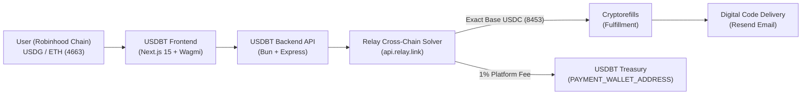

# USDBT App

[](https://github.com/USDBT/usdbt-app/actions/workflows/backend.yml)
[](LICENSE)
[](https://www.typescriptlang.org/)
[](https://bun.sh/)
[](https://nextjs.org/)
[](https://docs.robinhood.com/chain/)
[](https://base.org/)

> **$USDBT — Spend the Meme · No KYC · No Banks**  
> Instant non-KYC virtual cards and 500+ gift cards (Amazon, Uber, Apple, Steam, Netflix, Airbnb, DoorDash, and more) with automated email delivery.

---

## Overview

USDBT allows users to spend crypto directly on real-world gift cards and virtual Visa cards without sign-ups, bank intermediaries, or KYC verification.

### Key Features
- **Robinhood Chain Native Payments (`Chain ID: 4663`):** Pay seamlessly using **USDG** (Paxos Global Dollar, default) or native **ETH** on Robinhood Chain.
- **Relay Cross-Chain Settlement:** Powered by Relay Link (`api.relay.link`), transactions execute cross-chain fills directly to Base (`8453`) USDC deposit addresses with automated platform fee collection.
- **Cryptorefills Fulfillment:** Automated order creation and verification across 500+ top brand gift cards.
- **AI Conversational Shopping Agent:** Natural language gift card discovery and checkout with interactive Generative UI widgets in the chat stream.
- **Instant Digital Delivery:** Codes and activation details delivered to the user's inbox in seconds via Resend.

---

## Architecture



### Verified Network Specifications

| Parameter | Robinhood Chain (Payment) | Base (Fulfillment) |
| :--- | :--- | :--- |
| **Chain ID** | `4663` | `8453` |
| **Type** | Arbitrum Orbit / Nitro EVM L2 | OP Stack EVM L2 |
| **Gas Token** | `ETH` | `ETH` |
| **Currencies** | `USDG` (`0x5fc5360D0400a0Fd4f2af552ADD042D716F1d168`, 6 dec), `ETH` | `USDC` (`0x833589fCD6eDb6E08f4c7C32D4f71b54bdA02913`, 6 dec) |
| **Public RPC** | `https://rpc.mainnet.chain.robinhood.com` | `https://mainnet.base.org` |
| **Explorer** | [robinhoodchain.blockscout.com](https://robinhoodchain.blockscout.com) | [basescan.org](https://basescan.org) |

---

## Project Structure

```
.
├── app/                  # Next.js 15 App Router frontend
│   ├── api/              # Server-side API proxy routes
│   ├── layout.tsx        # Root layout with Wagmi & Theme providers
│   └── page.tsx          # Catalog, card dashboard, and checkout UI
├── components/           # React components (OrderForm, PaymentScreen, SpendView, UI)
├── hooks/                # Custom React hooks (wallet, orders, balances)
├── lib/                  # Frontend utilities, Wagmi config, and API client
├── backend/              # Bun + Express API
│   ├── src/
│   │   ├── index.ts      # Server entrypoint & middleware
│   │   ├── routes/       # API endpoints (/orders, /products, /balances, /users)
│   │   ├── services/     # Poller service, Cryptorefills API client, Resend email
│   │   └── lib/          # Database connection (Postgres), Relay solver client
│   ├── scripts/          # Database migration scripts
│   ├── tests/            # Bun unit & integration tests
│   └── Dockerfile        # Production container specification
└── .github/workflows/    # GitHub Actions CI/CD (backend automated deployment)
```

---

## Getting Started

### Prerequisites
- [Bun](https://bun.sh/) (v1.1+ recommended)
- Node.js 20+ (optional, Bun runtime is primary)
- A Web3 wallet supporting custom EVM networks or Robinhood Wallet

### 1. Repository Setup

```bash
git clone https://github.com/USDBT/usdbt-app.git
cd usdbt-app
```

### 2. Frontend Development

```bash
# Install dependencies
bun install

# Start Next.js development server with Turbopack
bun dev
```

Frontend runs at `http://localhost:3000`.

### 3. Backend Development

```bash
cd backend

# Install dependencies
bun install

# Run database migrations
bun run migrate

# Start backend development server with hot-reload
bun dev

# Run test suite
bun test
```

Backend API runs at `http://localhost:3001`.

---

## Environment Variables

### Frontend (`.env`)

```env
# WalletConnect Project ID (from https://cloud.walletconnect.com)
NEXT_PUBLIC_WALLETCONNECT_PROJECT_ID=your_project_id

# Backend API base URL
BACKEND_URL=http://localhost:3001
```

### Backend (`backend/.env`)

```env
PORT=3001
NODE_ENV=development
FRONTEND_URL=http://localhost:3000

# Database (Supabase PostgreSQL)
DATABASE_URL=postgresql://postgres.<project-ref>:<password>@aws-0-<region>.pooler.supabase.com:6543/postgres

# Robinhood Chain Configuration
ROBINHOOD_RPC_URL=https://rpc.mainnet.chain.robinhood.com
ROBINHOOD_CHAIN_ID=4663
ROBINHOOD_USDG_ADDRESS=0x5fc5360D0400a0Fd4f2af552ADD042D716F1d168

# Treasury & Fee Collection
PAYMENT_WALLET_ADDRESS=0x6bcB5Bac495be85C079d780b66352Cd9B1aAAc47

# Relay Cross-Chain Solver
RELAY_API_KEY=your_relay_api_key

# Base Chain (Cryptorefills Settlement)
BASE_RPC_URL=https://mainnet.base.org
BASE_CHAIN_ID=8453
USDC_TOKEN_ADDRESS=0x833589fCD6eDb6E08f4c7C32D4f71b54bdA02913

# Cryptorefills Partner API
CRYPTOREFILLS_PARTNER_ID=your_partner_id
SIMULATE=false

# Resend Email Service
RESEND_API_KEY=your_resend_api_key
EMAIL_FROM=cards@usdbt.us

# Authentication
JWT_SECRET=your_jwt_secret
```

---

## CI/CD & Deployment

- **Backend CI/CD:** Powered by GitHub Actions (`.github/workflows/backend.yml`).
  1. On push to `main` with changes under `backend/**`, runs `bun run check` and `bun test`.
  2. Builds and packages the container image, pushed to GitHub Packages (GHCR).
  3. Automatically triggers the Render deploy webhook to roll out the latest build.
- **Production API:** `https://usdbt-api.onrender.com`
- **Health Check:** `https://usdbt-api.onrender.com/health`

---

## License

This project is licensed under the [MIT License](LICENSE).
